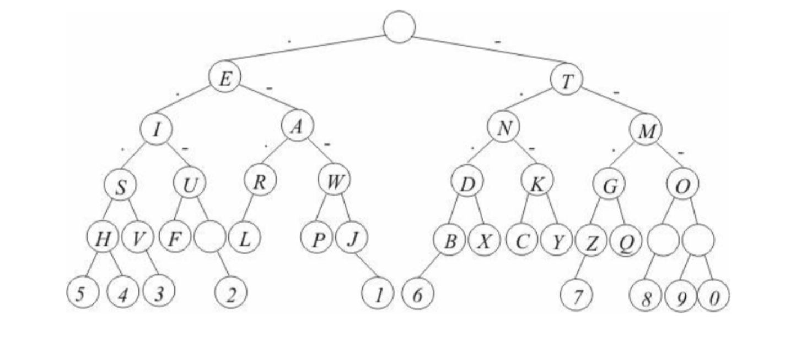

# Digital Telegraph

This project aims to develop an android app for communication in morse code through tapping on the phones/tablets screen.

To implement the translation of these sequences, the characters were stored in a binary tree, where going left means adding a short sign and going right means adding a long sign. To respect this order, a breadth search was implemented.

Created at 2016.1
